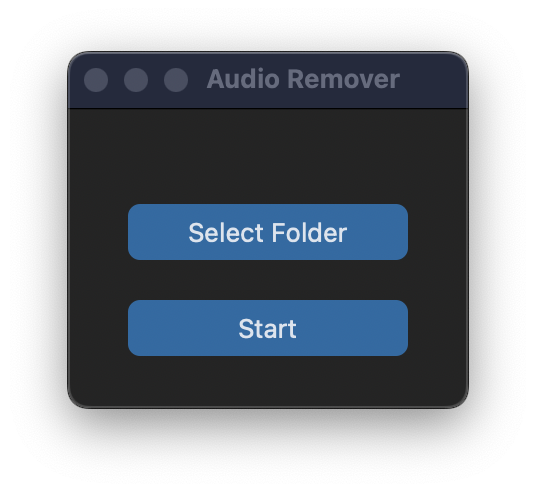

<h1 align="center">Audio Title Watermark Remover</h1>

<p align="center">
  

  

  

  

</p>

<p align="center">
  <a href="#dart-about">About</a> &#xa0; | &#xa0; 
  <a href="#sparkles-features">Features</a> &#xa0; | &#xa0;
  <a href="#rocket-technologies">Technologies</a> &#xa0; | &#xa0;
  <a href="#white_check_mark-requirements">Requirements</a> &#xa0; | &#xa0;
  <a href="#checkered_flag-starting">Starting</a> &#xa0; | &#xa0;
  <a href="#memo-license">License</a> &#xa0; | &#xa0;
  <a href="https://github.com/Mitchell-kolb" target="_blank">Author</a>
</p>

<br>

## :dart: About

This website https://spotify-downloader.com/ allows users to convert and download their spotify playlists 100 songs at a time but in the file title of each of the songs is the downloader site's watermark. This program removes that string of text in front of every song in the specified folder where your songs are located. 

- Before -> "[SPOTIFY-DOWNLOADER.COM] After Dark"
- After -> "After Dark"

## :sparkles: Features

:heavy_check_mark: Customtkinter GUI

:heavy_check_mark: Folder Wide Access



## :rocket: Technologies


The following tools were used in this project:

- [CustomTkinter](https://customtkinter.tomschimansky.com/)
- [Pyinstaller](https://pyinstaller.org/en/stable/index.html)

## :white_check_mark: Requirements

Before starting :checkered_flag:, you need to have [Git](https://git-scm.com) and [Python](https://www.python.org/downloads/) installed.

## :checkered_flag: Starting ##

```bash
# Clone this project
$ git clone https://github.com/Mitchell-kolb/audioTitleWatermarkRemover

# Access
$ cd audioTitleWatermarkRemover

# Install Dependencies
$ pip install -r requirements.txt

# Run the project
$ python3 audioRemover.py

```
OR
Check the Repo Releases for the compiled executable to download and run

## :memo: License

This project is under license from MIT. For more details, see the [LICENSE](LICENSE.md) file.


Made with :heart: by <a href="https://github.com/Mitchell-kolb" target="_blank">Mitchell</a>

&#xa0;

<a href="#top">Back to top</a>
